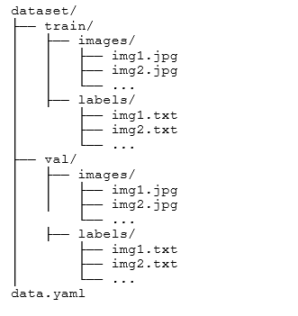

# yolov5_train

In Roboflow kannst du den Validation Split (val) erstellen, indem du die Daten während des Projekterstellungs- oder Exportprozesses in Trainings-, Validierungs- und Testdaten unterteilst. Hier ist eine Schritt-für-Schritt-Anleitung:

1. Daten hochladen
	•	Lade deine Bilder und Labels in Roboflow hoch:
	•	Gehe zu deinem Roboflow-Projekt.
	•	Klicke auf „+ Add Data“ und lade deine Bilder hoch.
	•	Stelle sicher, dass Labels korrekt zugeordnet sind.

2. Daten aufteilen (Train/Val/Test-Split erstellen)

Roboflow ermöglicht es, deine Daten in Trainings-, Validierungs- und Testdaten aufzuteilen. Das kannst du folgendermaßen machen:

2.1. Während der Projekterstellung
	•	Nach dem Hochladen der Bilder wirst du gefragt, wie du die Daten aufteilen möchtest.
	•	Gib den Split in Prozent an, z. B.:
	•	Train: 70%
	•	Validation (Val): 20%
	•	Test: 10%
	•	Roboflow verteilt die Bilder automatisch in die entsprechenden Sets.

2.2. Nachträglich

Falls du die Splits nachträglich ändern möchtest:
	•	Gehe zu deinem Projekt-Dataset.
	•	Wähle „Settings“ > „Dataset Splits“.
	•	Passe die Prozentsätze für Train/Val/Test an.

Hinweis: Roboflow aktualisiert die Splits basierend auf den neuen Prozentwerten. Bereits existierende Splits werden überschrieben.

3. Export der Daten
	•	Nach dem Setzen der Splits kannst du die Daten exportieren:
	1.	Gehe zu „Versions“ und wähle die gewünschte Version.
	2.	Klicke auf „Generate“ und wähle das YOLOv5-Format.
	3.	Lade die ZIP-Datei herunter.

Die heruntergeladene Datei enthält dann die Daten strukturiert in:

4. Überprüfung der Splits

Stelle sicher, dass:
	•	Train: Enthält den Großteil der Daten (für das Training).
	•	Validation (Val): Enthält Daten, die während des Trainings verwendet werden, um die Leistung zu überprüfen.
	•	Test: Optional, wird nach dem Training verwendet, um die endgültige Modellleistung zu testen.

5. Tipps
	•	Stratifizierte Splits: Roboflow versucht, die Verteilung der Klassen in den Splits gleichmäßig zu halten.
	•	Manuelles Anpassen: Falls bestimmte Bilder manuell in „val“ oder „test“ verschoben werden sollen, kannst du dies in der Bildübersicht von Roboflow tun.

----

1. Export aus Roboflow:
	•	Stelle sicher, dass der Export aus Roboflow im YOLOv5-Format erfolgt.
	•	Wähle beim Export „YOLOv5 PyTorch“ aus.
	•	Lade die ZIP-Datei herunter, die Bilder und Annotations enthält.

2. Struktur des Datasets:

Die Datenstruktur für YOLOv5 sollte wie folgt aussehen:

dataset/

├── train/
│   ├── images/
│   │   ├── img1.jpg
│   │   ├── img2.jpg
│   │   └── ...
│   ├── labels/
│       ├── img1.txt
│       ├── img2.txt
│       └── ...
├── val/
│   ├── images/
│   │   ├── img1.jpg
│   │   ├── img2.jpg
│       └── ...
│   ├── labels/
│       ├── img1.txt
│       ├── img2.txt
│       └── ...

data.yaml

3. Daten korrekt einbinden:

3.1. Daten entpacken und strukturieren
	•	Entpacke die heruntergeladene ZIP-Datei von Roboflow.
	•	Stelle sicher, dass die Ordnerstruktur wie oben beschrieben eingerichtet ist. Roboflow liefert oft bereits eine fertige Struktur, du musst sie nur überprüfen.

3.2. data.yaml Datei erstellen

Die Datei data.yaml definiert die Pfade zu deinen Trainings- und Validierungsdaten und listet die Klassen auf. Ein Beispiel:

train: dataset/train/images
val: dataset/val/images

nc: 2  # Anzahl der Klassen
names: ['class1', 'class2']  # Ersetze mit deinen Klassennamen

• train: Pfad zu den Trainingsbildern.
• val: Pfad zu den Validierungsbildern.
• nc: Anzahl der Klassen.
• names: Liste der Klassennamen.

Hinweis: Roboflow exportiert oft die Datei data.yaml automatisch. Überprüfe, ob sie korrekt ist.

4. YOLOv5-Training starten:

4.1. YOLOv5 Repository klonen

Falls noch nicht geschehen, klone das YOLOv5-Repository:

git clone https://github.com/ultralytics/yolov5.git

cd yolov5

4.2. Abhängigkeiten installieren

Installiere die notwendigen Pakete:

pip install -r requirements.txt

4.3. Training starten

Starte das Training mit folgendem Befehl:

python train.py --img 640 --batch 16 --epochs 50 --data dataset/data.yaml --weights yolov5s.pt

•	--img: Bildgröße (640 ist Standard).
•	--batch: Batch-Größe (abhängig von der GPU-Kapazität).
•	--epochs: Anzahl der Trainingsdurchläufe.
•	--data: Pfad zur data.yaml Datei.
•	--weights: Vortrainierte Gewichte (z. B. yolov5s.pt).

5. Ergebnisse überprüfen

Nach Abschluss des Trainings findest du die Ergebnisse im Ordner runs/train/exp. Darin befinden sich:
	•	Trainingsstatistiken (results.png).
	•	Gewichte (best.pt und last.pt).

 ---

 Gewichte (Weights) wie z. B. best.pt oder last.pt sind gespeicherte Modelle, die die Parameter (Gewichte und Biases) eines neuronalen Netzes enthalten. Sie repräsentieren den Zustand des Modells nach dem Training. Im Kontext von YOLOv5 haben diese Dateien folgende Bedeutung:

1. best.pt
	•	Dies sind die besten Gewichte, die während des Trainings erreicht wurden.
	•	Basierend auf der Validierungsleistung (z. B. mAP, Präzision, Recall) wird diese Datei gespeichert, sobald das Modell eine bessere Performance erzielt.
	•	Du kannst best.pt verwenden, um das Modell für Inferenz zu nutzen, da es die bestmögliche Leistung bietet.

2. last.pt
	•	Dies sind die Gewichte des Modells nach dem letzten Trainingsepoch.
	•	Es kann sein, dass diese nicht die beste Leistung repräsentieren, wenn das Modell während des Trainings zu stark angepasst wurde (Overfitting).
	•	Diese Datei ist nützlich, wenn du ein Training fortsetzen oder debuggen möchtest.

3. Wofür werden die Gewichte verwendet?

3.1. Für die Inferenz (Vorhersagen)

Die Gewichte werden verwendet, um das trainierte Modell auf neue Daten anzuwenden. Zum Beispiel:

python detect.py --weights best.pt --img 640 --conf 0.5 --source path/to/images

•	--weights: Gibt die Gewichtedatei an (best.pt oder eine andere .pt-Datei).
•	--source: Ordner oder Datei mit Bildern/Videos, die analysiert werden sollen.
•	Das Modell verwendet die gespeicherten Gewichte, um Objekte zu erkennen.

3.2. Für das Fine-Tuning

Wenn du ein vortrainiertes Modell weiter trainieren möchtest, kannst du die Gewichte als Ausgangspunkt verwenden:

python train.py --img 640 --batch 16 --epochs 20 --data data.yaml --weights best.pt

•	Dies spart Rechenzeit, da das Modell bereits eine solide Grundlage hat.

4. Wie wird best.pt generiert?

Während des Trainings wird nach jeder Epoche die Leistung des Modells auf den Validierungsdaten evaluiert. Wenn das Modell in einer Epoche besser abschneidet als zuvor, speichert YOLOv5 die neuen Gewichte als best.pt.

Zusammengefasst:
•	best.pt: Beste Leistung während des Trainings.
•	last.pt: Letzte gespeicherte Gewichte am Ende des Trainings.
•	Beide können für Vorhersagen oder Fine-Tuning verwendet werden.

---
---

